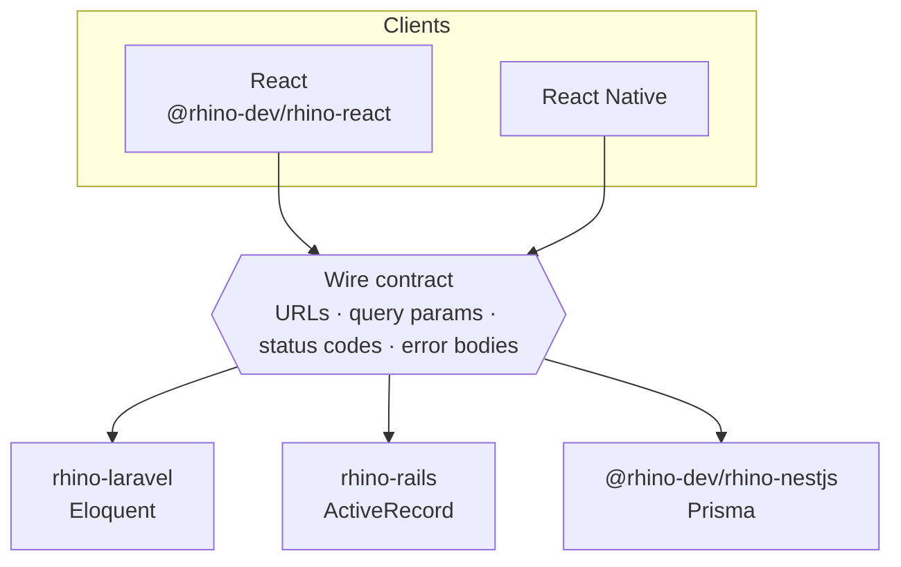
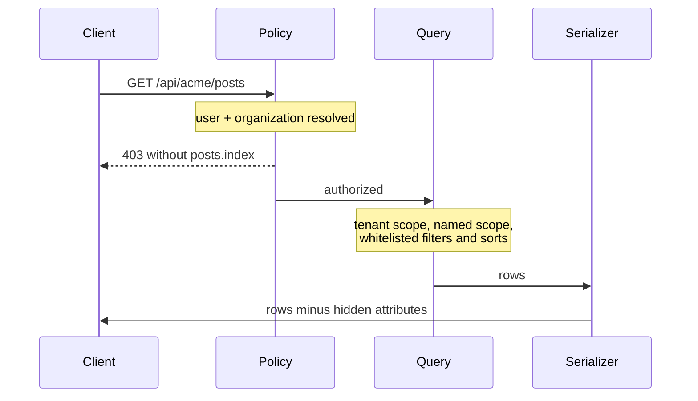

Rhino 4 ships as three server libraries: `rhino-laravel`, `rhino-rails` and `@rhino-dev/rhino-nestjs`. They share no code. What they share is a wire contract: the same URLs, the same query parameters, the same status codes and the same error bodies. This post walks through one model in all three, and then the client that cannot tell them apart.

<!-- truncate -->



## Declare, don't write

The model in Rhino is the unit of API design. You register it, declare what is queryable, and declare who may do what in a policy. Rhino generates the routes, authorizes the action, scopes the query to the tenant, serializes the response and strips the columns the user may not see.

```
Declare (model + policy + config)  →  Rhino generates and enforces  →  REST API
```

Here is a `Post` in each stack.

**Laravel** — static properties on an Eloquent model:

```php title="app/Models/Post.php"
use Rhino\Models\RhinoModel;

class Post extends RhinoModel
{
    protected $fillable = ['title', 'content', 'status', 'user_id'];

    public static $allowedFilters  = ['status', 'user_id'];
    public static $allowedSorts    = ['created_at', 'title', 'updated_at'];
    public static $defaultSort     = '-created_at';
    public static $allowedIncludes = ['user', 'comments'];
    public static $allowedSearch   = ['title', 'content'];
}
```

```php title="config/rhino.php"
'models' => [
    'posts' => \App\Models\Post::class,
],
```

**Rails** — a `rhino_*` DSL on an ActiveRecord model:

```ruby title="app/models/post.rb"
class Post < Rhino::RhinoModel
  rhino_filters  :status, :user_id
  rhino_sorts    :created_at, :title, :updated_at
  rhino_default_sort '-created_at'
  rhino_includes :user, :comments
  rhino_search   :title, :content

  belongs_to :user
  has_many :comments
end
```

```ruby title="config/initializers/rhino.rb"
Rhino.configure do |c|
  c.model :posts, 'Post'
end
```

**NestJS** — a plain Prisma model plus a registration object, with no base class and no decorators:

```ts title="src/rhino.config.ts"
models: {
  posts: {
    model: 'post',
    softDeletes: true,
    allowedFilters: ['status', 'userId'],
    allowedSorts: ['createdAt', 'title', 'updatedAt'],
    defaultSort: '-createdAt',
    allowedIncludes: ['author', 'comments'],
    allowedSearch: ['title', 'content'],
  },
},
```

Each declaration follows its framework's idiom. The output is the same.

## What you get

| Method | Endpoint | Description |
|---|---|---|
| `GET` | `/api/posts` | List with filters, sorts, search, pagination |
| `POST` | `/api/posts` | Create with validation |
| `GET` | `/api/posts/{id}` | Show a single record |
| `PUT` | `/api/posts/{id}` | Update with validation |
| `DELETE` | `/api/posts/{id}` | Soft delete |
| `GET` | `/api/posts/trashed` | List soft-deleted records |
| `POST` | `/api/posts/{id}/restore` | Restore |
| `DELETE` | `/api/posts/{id}/force-delete` | Permanent delete |

With multi-tenancy enabled, the same routes sit under `/api/{organization}/…` and every query is confined to that organization.

The query string is part of the contract too, and everything composes in one request:

```bash
GET /api/posts?filter[status]=draft,published&sort=-created_at&search=rhino&include=user&page=2&per_page=25
```

Pagination metadata comes back in headers (`X-Current-Page`, `X-Last-Page`, `X-Per-Page`, `X-Total`), so the body is always just the data.

Every one of those requests goes through the same pipeline, in every stack:



## Whitelists are the security boundary

Notice that every query capability above is opt-in. A column that is not in the filter list cannot be filtered on; the parameter is ignored. Adding a column to a whitelist is an authorization decision, and it is visible in code review as a one-line diff on the model.

Policies add the per-user layer. A policy maps each action to a `{resource}.{action}` permission (`posts.index`, `posts.store`, with `posts.*` and `*` as wildcards), and it also decides which attributes a user may read and write:

```php title="app/Policies/UserPolicy.php"
class UserPolicy extends ResourcePolicy
{
    protected $resourceSlug = 'users';

    public function hiddenAttributesForShow(?Authenticatable $user): array
    {
        return $user?->hasRole('admin') ? [] : ['stripe_id', 'internal_notes'];
    }
}
```

A hidden attribute is hidden from queries as well as from responses. It cannot be used in `?filter[]` or `?sort`, and `?search=` skips it. Otherwise a client could recover a hidden column by sorting on it. Rails (`hidden_attributes_for_show`) and NestJS (`hiddenAttributesForShow(user, org?)`) expose the same hook with the same behavior.

## The client cannot tell the difference

Because the contract is identical, there is one client. `@rhino-dev/rhino-react` is a set of TanStack Query hooks that works against any of the three servers, on React and React Native:

```tsx title="src/components/PostsList.tsx"
import { useModelIndex, useModelStore } from '@rhino-dev/rhino-react';

function PostsList() {
  const { data: response, isLoading } = useModelIndex('posts', {
    page: 1,
    perPage: 20,
    sort: '-created_at',
    includes: ['user'],
  });
  const createPost = useModelStore('posts');

  if (isLoading) return <div>Loading...</div>;

  return (
    <div>
      <button onClick={() => createPost.mutate({ title: 'Hello' })}>New</button>
      <ul>
        {response?.data.map(post => (
          <li key={post.id}>{post.title} — by {post.user?.name}</li>
        ))}
      </ul>
      <p>Page {response?.pagination?.currentPage} of {response?.pagination?.lastPage}</p>
    </div>
  );
}
```

The hook reads the pagination headers for you. Each server can also export TypeScript interfaces for its models, so the client's types come from the same declarations as the API.

## Why hold three libraries to one contract

It costs something. Every feature is designed as a wire contract first (URL, parameters, envelope, status codes, error strings) and then implemented three times. What it buys:

- **A front end that survives a backend change.** The React app depends on the contract, not on the framework.
- **Documentation and tooling that transfer.** A Postman collection, a mobile client or an AI agent's knowledge of "how a Rhino API behaves" applies to every Rhino app.
- **Honest feature parity.** Named scopes, computed attributes and request classes work the same way in all three stacks, with each one written in its framework's idiom.

## Try it

```bash
# Laravel
composer require rhino-project/rhino-laravel:^4.0 && php artisan rhino:install

# Rails
bundle add rhino-rails -v "~> 4.0" && rails rhino:install

# NestJS
npm install @rhino-dev/rhino-nestjs@^4.0 && npx rhino install

# React client
npm install @rhino-dev/rhino-react@^4.0 @tanstack/react-query axios
```

Each stack's getting-started page is a complete feature map: [Laravel](/laravel/getting-started), [Rails](/rails/getting-started), [NestJS](/nestjs/getting-started), [React](/react/getting-started).
