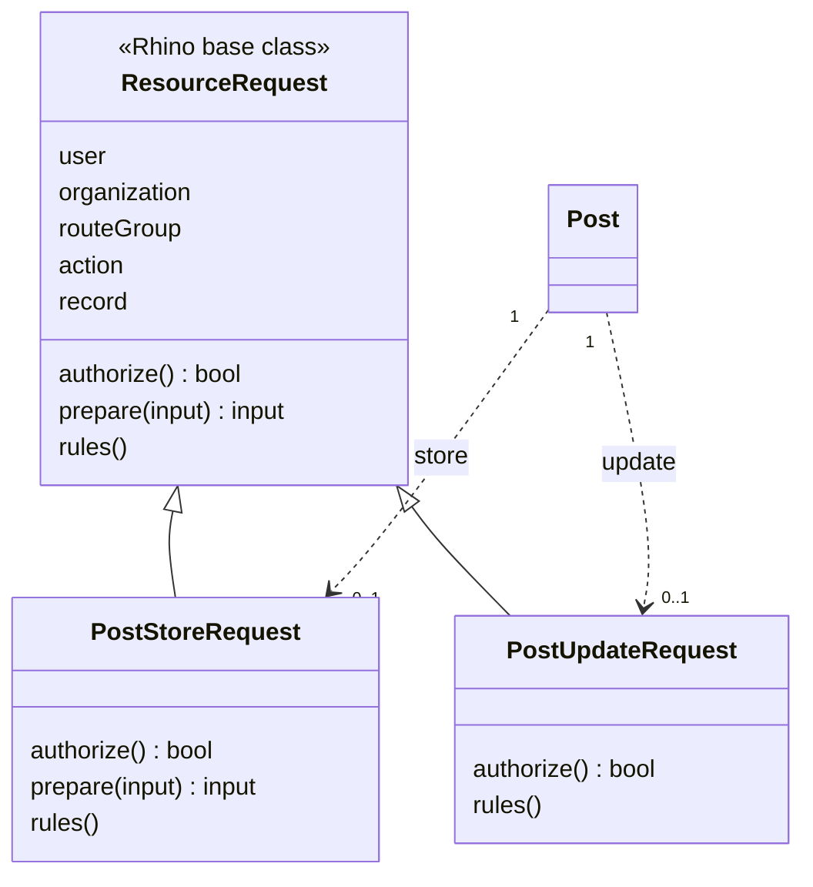
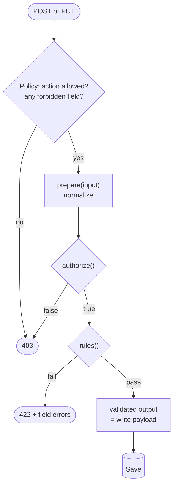

Until 4.10, a Rhino model validated itself. That worked for static format rules and for little else: the rules could not see who was asking, which organization they were in, which app the request came through, or what the record looked like before the update. Rhino 4.10 moves validation into a request class that can see all of it.

<!-- truncate -->

## One class per write action

Each model gets a store request and an update request. Each one owns the full shape contract for its action: what is authorized, how input is normalized, and which rules apply.

**Laravel** finds `{Model}StoreRequest` and `{Model}UpdateRequest` in `App\Http\Requests` by convention:

```php title="app/Http/Requests/PostStoreRequest.php"
use Rhino\Http\Requests\ResourceRequest;

class PostStoreRequest extends ResourceRequest
{
    public function authorize(): bool
    {
        return $this->routeGroup() !== 'public';
    }

    public function prepare(array $input): array
    {
        if (is_string($input['title'] ?? null)) {
            $input['title'] = trim($input['title']);
        }

        return $input;
    }

    public function rules(): array
    {
        return [
            'title'       => 'required|string|max:255',
            'status'      => $this->user()?->getRoleSlugForValidation($this->organization()) === 'admin'
                ? 'required|string'
                : 'required|string|in:draft',
            'category_id' => 'required|integer|exists:categories,id', // org-scoped automatically
        ];
    }
}
```

**Rails** autoloads the same names from `app/requests/`, with ordinary ActiveModel declarations:

```ruby title="app/requests/post_store_request.rb"
class PostStoreRequest < Rhino::ResourceRequest
  attribute :title, :string
  attribute :category_id, :integer

  validates :title, presence: true, length: { maximum: 255 }
  validates :category_id, presence: true

  def authorize? = route_group != "public"

  def prepare(input)
    title = input["title"]
    input.merge("title" => title.is_a?(String) ? title.strip : title)
  end
end
```

**NestJS** registers the classes on the model and uses Zod for the rules:

```ts title="src/requests/post-store.request.ts"
export class PostStoreRequest extends ResourceRequest {
  override authorize(ctx: ResourceRequestContext) {
    return ctx.routeGroup !== 'public';
  }

  override prepare(input: Record<string, any>) {
    return {
      ...input,
      title: typeof input.title === 'string' ? input.title.trim() : input.title,
    };
  }

  rules(ctx: ResourceRequestContext) {
    return z.object({
      title: z.string().max(255),
      categoryId: z.number().int(),
    });
  }
}
```

```ts title="src/rhino.config.ts"
posts: { model: 'post', requests: { store: PostStoreRequest, update: PostUpdateRequest } },
```

The three share one shape:



## The order of a write



## What the class can see

| Context | Laravel | Rails | NestJS |
|---|---|---|---|
| Current user | `$this->user()` | `user` | `ctx.user` |
| Organization | `$this->organization()` | `organization` | `ctx.organization` |
| Route group | `$this->routeGroup()` | `route_group` | `ctx.routeGroup` |
| Action | `$this->action()` | `action` | `ctx.action` |
| Record before the write (update only) | `$this->record()` | `record` | `ctx.record` |

That table is the point of the feature. "Editors may only create drafts", "this field is required in the driver app but not in the dashboard" and "status may only move forward from its current value" are now a few lines in the place a reader expects to find them.

## Four things to know before you rely on it

**1. The validated output is the write payload.** A field with no rule (Laravel), no `attribute` (Rails) or no schema key (NestJS) is dropped, not saved. That includes a field `prepare` added. Declaring a field is how you allow it to be written. Rhino also does not relax an update's rules to the keys the client sent, so an update request makes its own fields optional.

**2. The policy still goes first.** Which fields a role may write stays on the policy (`permittedAttributesForCreate` / `…ForUpdate`). A forbidden field is a `403` before the request class runs, so `prepare` cannot launder a denied field past the policy.

**3. `403` and `422` mean different things.** `authorize` returning false is a `403` that is indistinguishable from a policy denial, so it gives nothing away about why. Failing rules are a `422` with field-level errors:

```bash
curl -X POST '/api/acme/posts' -d '{"title":"","status":"published","category_id":4}'
```

```json
{ "errors": { "title": ["The title field is required."], "status": ["The selected status is invalid."] } }
```

**4. Foreign keys stay inside the tenant.** A `category_id` that points at another organization's category is rejected. In Laravel that happens through the `exists:` rule, which Rhino scopes to the organization for classes extending `ResourceRequest`. A plain `FormRequest` is accepted too, but it gets no context helpers, no `prepare` and no org-scoping on `exists:`.

`prepare` sees raw client input, so guard types before calling string functions, as the examples do. Leave malformed values for the rules to reject.

## Nested operations use them too

`POST /api/nested` runs up to 50 create, update and delete operations in one transaction, with `$N.field` references between them. Each operation is validated by the same request class as its single-resource equivalent. References are stripped before validation and merged back into the payload afterwards, so a request class never sees a placeholder.

## Migrating

Nothing breaks. Model-level validation is deprecated and unchanged: it still applies to every model and action that has no request class, with no runtime warning. It will be removed in **5.0**. No route, query parameter, status code or error envelope changed, and the React client needs no upgrade.

Two things to check before you deploy:

- **Name collisions.** If your Laravel or Rails app already has a class named `{Model}StoreRequest` or `{Model}UpdateRequest` for a Rhino-registered model, convention discovery will start applying it.
- **Dropped fields.** When you move a model over, every writable field needs a rule. A field you forget is silently no longer saved.

In Laravel, `php artisan rhino:generate` has a `request` entry that writes a commented stub for store, update or both.

A model can move one action at a time, and a project can move one model at a time. The recommended order is to start with the model whose rules you have been working around.

Full references: [Laravel](/laravel/validation), [Rails](/rails/validation), [NestJS](/nestjs/validation). Upgrade notes are on each stack's upgrading page.
