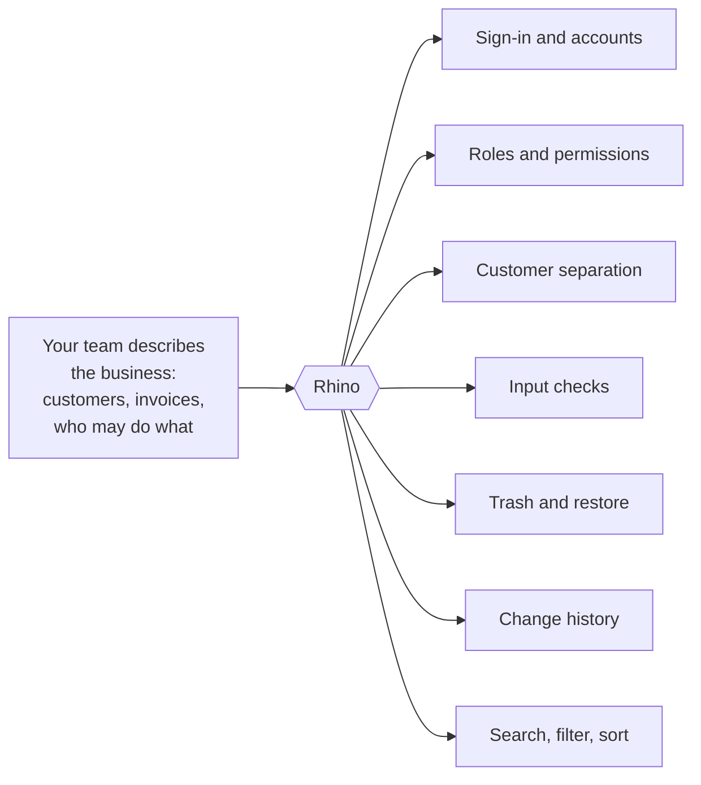
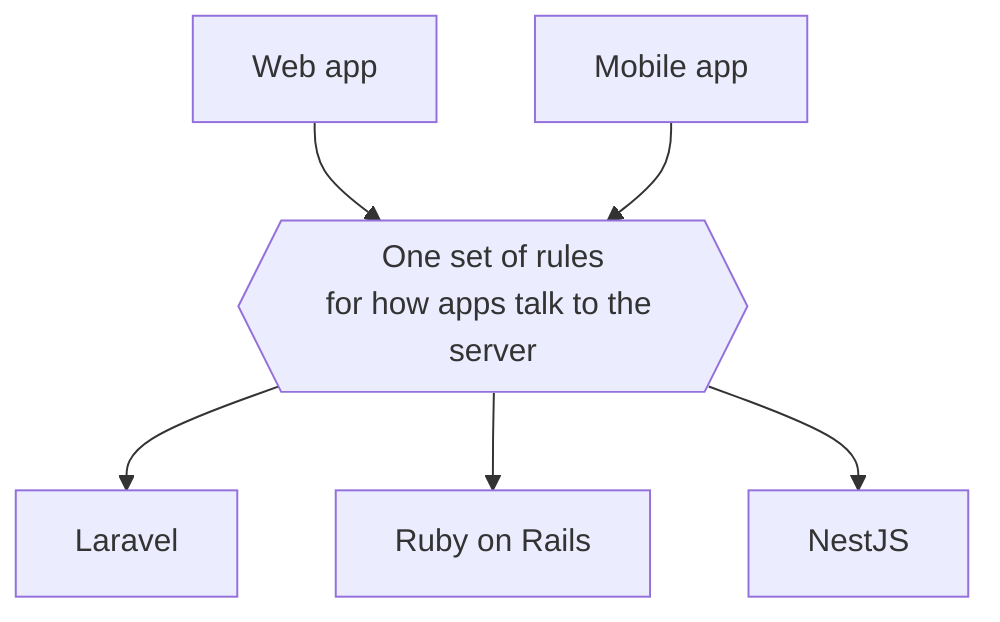

Every business application has two halves. One is the part that makes it yours: the idea, the workflow, the screens your customers pay for. The other is the part every application needs before the first one can be trusted with real customers. Rhino 4 builds the second half for you.

<!-- truncate -->

## The half nobody sees

Think about what has to be true before a customer can safely use a piece of business software:

- People can sign in, sign out and reset a forgotten password.
- Each person sees only what their role allows.
- One customer's company never sees another customer's data.
- Bad input is rejected before it is saved.
- Deleted records can be recovered.
- There is a record of who changed what, and when.
- Lists can be searched, filtered, sorted and paged.

None of this is your product. All of it is required. On a typical project it takes weeks to build, and it gets rebuilt, slightly differently, on every new project.

## What Rhino does about it

Rhino is an open-source library that your developers add to the application's server. They describe the things the business deals with (customers, invoices, tickets, contracts) and say who is allowed to do what with each of them. Rhino turns those descriptions into a working, secured back end.

The important word is *describe*. Your team does not write the sign-in system, the permission checks or the data isolation by hand. They state the rules, and Rhino enforces them the same way everywhere.

That has three practical effects.

**You reach a working product sooner.** The weeks normally spent on plumbing go into the features customers see.

**The rules are applied consistently.** When security is written by hand, screen by screen, the mistakes come from the one place somebody forgot. When it comes from a single set of rules, there is no forgotten place.

**The code stays readable.** A new developer, or an AI coding assistant, can open the project and find the rules for invoices in one predictable spot.

## What is in the box

| You need | Rhino 4 provides |
|---|---|
| Accounts | Sign-in, sign-out, password reset and invitations |
| Roles | Permissions per role, with exceptions for individual people |
| Customer separation | Each organization's data kept apart, automatically |
| Data quality | Input checked before anything is saved |
| Safety net | A trash for deleted records, with restore |
| Accountability | An audit trail of every change |
| Usable lists | Search, filters, sorting and paging on everything |
| A front end to match | Ready-made building blocks for React web and mobile apps |

## It fits the team you already have

Rhino 4 is not a new platform to migrate to. It is a library for three of the most widely used server frameworks: **Laravel**, **Ruby on Rails** and **NestJS**. Your team keeps its language, its hosting and its tools.

All three versions behave the same way from the outside. A web or mobile app built against a Rhino back end does not need to know which of the three is behind it. If you run more than one team, or change technology later, the front end's expectations stay the same.

## What it does not do

Rhino does not design your product, and it is not a no-code tool. Your developers still write the parts that are unique to your business, and they can step outside Rhino wherever a feature needs something unusual. Rhino handles the common 80% so that their time goes to the 20% that is yours.

It is also free and open source. There is no licence fee and no hosted service you depend on. The code runs inside your own application.

## Where to go next

- Sending this to your developers? Point them at the [introduction](/intro), which has a working example for each framework.
- Building with AI tools? Read [what AI forgets when it builds your app](/blog/what-ai-forgets).
- Want the security story without the jargon? Read [who can see what](/blog/who-can-see-what).
