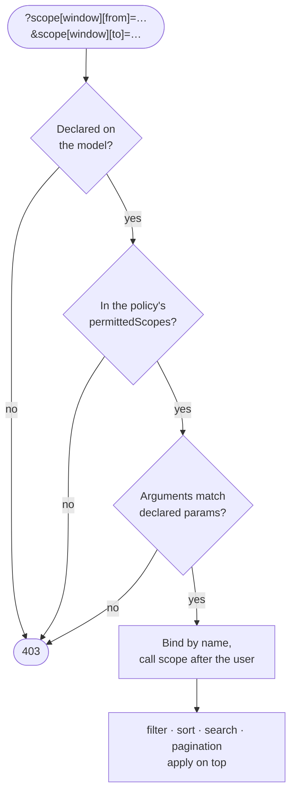
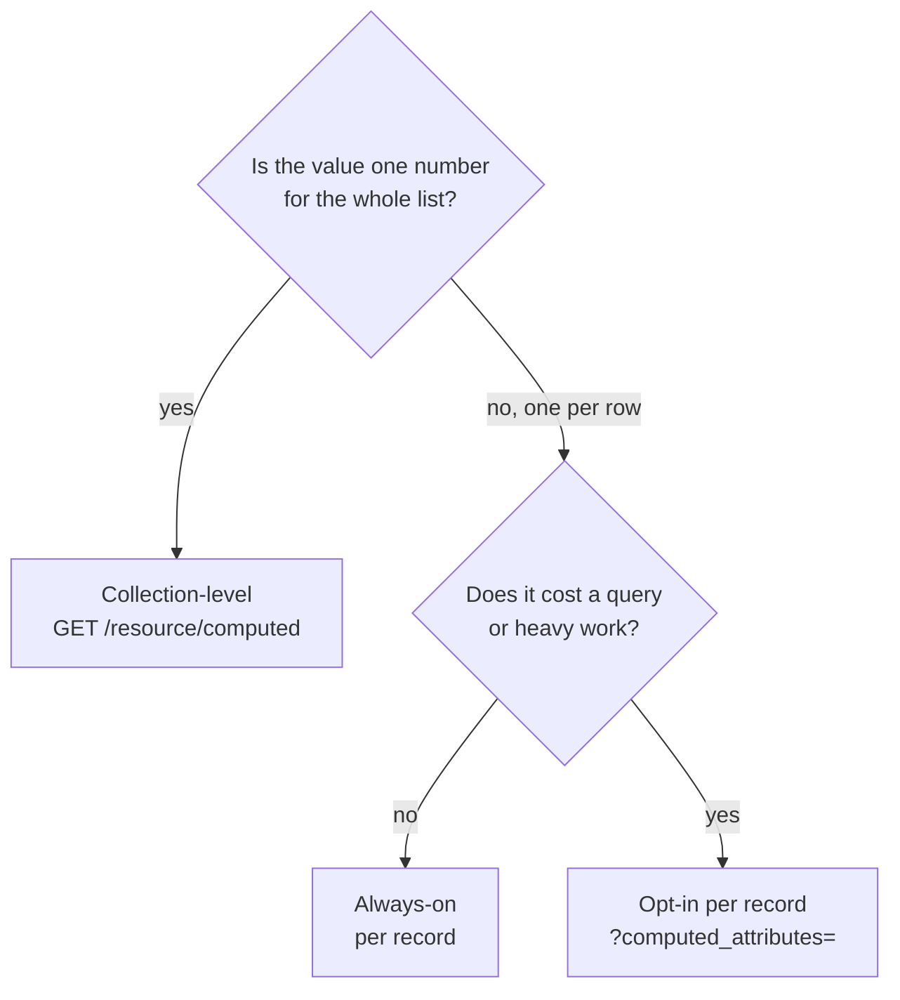

Two requests push most teams out of a generated API and into hand-written controllers. One is "a list, but with a query too complex for filters". The other is "a number for the dashboard". Rhino 4 has a declarative answer to both, and since 4.8 and 4.9 both answers take arguments.

<!-- truncate -->

## Named scopes: the server owns the query

Filters let the client compose a predicate from whitelisted columns. That is the wrong tool when the predicate involves joins, the current user, or logic you do not want expressed in a URL. A named scope is a server-defined query fragment that the client selects by name:

```bash
GET /api/routes?scope=availableForDrivers
```

The model whitelists which scopes can be selected, and may name a default that applies when the client sends none.

```php title="app/Models/Route.php (Laravel)"
class Route extends RhinoModel
{
    public static $allowedScopes = ['availableForDrivers'];
    public static $defaultScope  = 'active';

    public function scopeAvailableForDrivers(Builder $query, ?Authenticatable $user): Builder
    {
        if (! $user) {
            return $query->whereRaw('1 = 0'); // fail closed
        }

        return $query
            ->where('status', 'active')
            ->whereHas('region.driverQualifications', fn ($q) => $q
                ->where('driver_id', $user->id)
                ->where('expires_at', '>', now()));
    }
}
```

The current user is resolved server-side and handed to the scope. The client never sends an identity, only a name.

### Scopes with parameters

A scope that was only a name forced everything variable back into filters. A scope can now declare parameters:

```php title="Laravel"
public static $allowedScopes = [
    'archived',                                  // no parameters
    'since'  => 'date',                          // one
    'window' => ['from', 'to'],                  // two, both required
    'titled' => ['params' => ['title', 'status'], 'optional' => ['status']],
];

public function scopeWindow(Builder $query, ?Authenticatable $user, $from, $to): Builder
{
    return $query->whereBetween('created_at', [$from, $to]);
}
```

```ruby title="Rails"
class Route < Rhino::RhinoModel
  rhino_scopes :archived,
               since:  { params: [:date] },
               window: { params: %i[from to] },
               titled: { params: %i[title status], optional: [:status] }

  scope :since,  ->(date) { where("created_at >= ?", date) }
  scope :window, ->(from, to) { where(created_at: from..to) }
end
```

```ts title="NestJS"
export class WindowScope implements RhinoNamedScope {
  static params = ['from', 'to'];
  static optionalParams = ['to'];

  apply(ctx: ScopeContext): Record<string, any> {
    const where: Record<string, any> = { createdAt: { gte: ctx.args!.from } };
    if (ctx.args!.to !== undefined) where.createdAt.lte = ctx.args!.to;
    return where;
  }
}
```

On the wire, all three read the same bracket form:

```bash
GET /api/routes?scope[since]=2026-01-01
GET /api/routes?scope[window][from]=2026-01-01&scope[window][to]=2026-02-01
```

A selection has to pass three gates before any client value reaches your query:



The rules are strict on purpose:

- Arguments bind **by name**. A positional list is refused.
- A scope that declares no parameters never receives client input. Sending any is a `403`.
- An unknown scope, a scope the policy does not permit, or mismatched arguments are all a `403`.
- Up to three scopes can be combined in one request (configurable). They apply in URL order.

The policy decides who may select what, through `permittedScopes()` (`permitted_scopes` in Rails). It returns `['*']` by default.

:::warning A default scope is not a security boundary
The default scope is a listing default that a client replaces the moment it selects another one. Row restrictions that must always hold, such as tenancy or visibility, belong in an always-on global scope that no `?scope=` value can bypass.
:::

## Computed attributes: the number for the dashboard

"How many users are active?" is not a field on a user. It is one aggregate over the collection. Rhino has three kinds of computed attribute, chosen by cost:

| Kind | Evaluated |
|---|---|
| Always-on, per record | Every row of every read |
| Opt-in, per record | Only when the client sends `?computed_attributes=` |
| Collection-level aggregate | Once per request, via `GET /{resource}/computed` |



All three pass through the same policy gate as database columns, so a role that cannot see `total` cannot see an aggregate you declare over it unless the policy allows that attribute.

### One `revenue`, not three

Before parameters, anything the client needed to vary became its own attribute: `revenue_last_30_days`, `revenue_last_90_days`, `revenue_ytd`. Now the attribute declares what varies:

```php title="Laravel"
public static function rhinoCollectionComputedAttributes(): array
{
    return [
        'active_users_count' => fn ($query, $user) => $query->where('status', 'active')->count(),
        'revenue' => [
            'params' => ['from', 'to'],
            'using'  => fn ($query, $user, $from, $to) => $query
                ->whereBetween('created_at', [$from, $to])
                ->sum('total'),
        ],
    ];
}
```

```ruby title="Rails"
def self.rhino_collection_computed_attributes
  {
    "revenue" => {
      params: %i[from to],
      with: ->(scope, _user, from, to) { scope.where(created_at: from..to).sum(:total) }
    }
  }
end
```

```ts title="NestJS"
collectionComputedAttributes: {
  revenue: {
    params: ['from', 'to'],
    using: async (ctx) => {
      const result = await ctx.delegate.aggregate({
        where: { ...ctx.where, createdAt: { gte: ctx.args!.from, lte: ctx.args!.to } },
        _sum: { total: true },
      });
      return result._sum.total;
    },
  },
},
```

```bash
curl -g '/api/users/computed?attributes[revenue][from]=2026-01-01&attributes[revenue][to]=2026-02-01'
```

```json
{ "data": { "revenue": 48210.5 } }
```

The query handed to the callable is already tenant-scoped and already narrowed by any `filter`, `search` and `scope` on the request. The number therefore describes the list the user is looking at.

A few behaviors worth knowing:

- `"true"` and `"false"` arrive as real booleans.
- The declared check and the policy check run before any argument is bound. An undeclared attribute and a denied one return the same error, so the messages that name a parameter are only reachable by a caller who may already use the attribute.
- A bare `GET /{resource}/computed` returns every allowed attribute except those with a required parameter. Those are skipped, not errored, so adding one never breaks a client that asks for everything.
- In NestJS, per-record attributes are not awaited. Put anything that hits Prisma in a collection-level attribute.

## From React

The client takes the same shapes as objects and serializes the bracket form:

```tsx
const query = { scope: { window: { from: '2026-01-01', to: '2026-02-01' } } };

const { data: routes } = useModelIndex('routes', query);

const { data: stats } = useModelComputedAttributes('users', {
  attributes: {
    revenue: { from: '2026-01-01', to: '2026-02-01' },
    activeUsersCount: null,
  },
});
```

Pass the same `filters`, `search` and `scope` to both hooks, and the stats stay in step with the table.

## Which tool for which problem

| You want to… | Use |
|---|---|
| Return a count or a sum | A collection-level computed attribute |
| Add a derived field to each row | A per-record computed attribute (opt-in if it costs a query) |
| Let clients pick a complex predefined query | A named scope |
| Always restrict rows | A global scope, never the default scope |
| Something that is not "attributes of one resource" | A custom controller, built on Rhino's tenant-safe query resolver |

Full references: named scopes in [Laravel](/laravel/querying#named-scopes), [Rails](/rails/querying#named-scopes) and [NestJS](/nestjs/querying#named-scopes); computed attributes in [Laravel](/laravel/computed-attributes), [Rails](/rails/computed-attributes) and [NestJS](/nestjs/computed-attributes).
