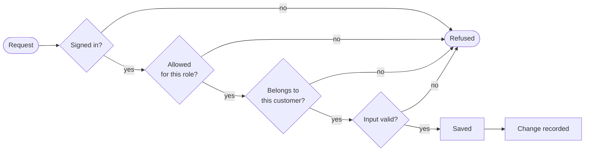
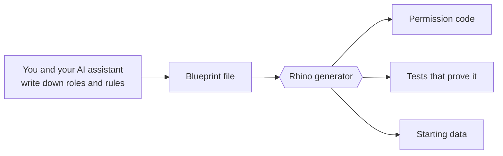

You describe an app to an AI coding tool on Friday. By Sunday there are screens, a database and a demo that works. The demo is real, and so is the problem: what you can see in a demo is not what makes software safe to give to customers.

<!-- truncate -->

## A demo tests the happy path

In a demo, one person signs in and clicks through the screens in the intended order. Nobody tries to open another company's invoice by changing a number in the address bar. Nobody submits a form with a field they were never supposed to edit. Nobody asks, six months later, who deleted the contract.

Those questions arrive with real customers, and they are the ones AI-built apps most often cannot answer. The pattern is consistent:

- **Sign-in exists, but permissions do not.** Every signed-in user can do everything.
- **Customers share one pool of data.** Nothing separates company A from company B except the screens.
- **Input is trusted.** Whatever the form sends is saved.
- **There is no history.** Changes leave no trace.
- **There are no tests.** Nothing would notice if any of the above got worse.

This is not because the AI is careless. It builds what was asked for, and nobody asks for "tenant isolation" in a weekend prompt. Each missing piece is also the kind of work that must be done the same way in fifty places. Asking a tool to write similar code fifty times produces fifty slightly different versions, and security problems are found in the differences.

## Fewer lines to get wrong

Rhino takes a different route. The repetitive, safety-critical work is not written at all, by a person or by an AI. It is provided by the library.

To add invoices to a Rhino app, the developer or the AI agent writes a short description: what an invoice is, which fields it has, and which roles may read or change it. Rhino supplies everything that follows from that description, including the sign-in check, the permission check, the separation between customers, the input checks and the change history.

Every request to a Rhino back end passes the same series of checks, whether or not anyone remembered to ask for them:

An AI agent working this way writes a few dozen lines of rules. It does not write hundreds of lines of plumbing. There is less to review, and what is there reads like a policy: "viewers can see the title and status, and cannot see the total value."

## Guardrails for the agent itself

Rhino 4 is also built to be read by AI agents, in three ways.

**The documentation is written for them.** Each framework's getting-started page summarizes every feature the library ships, so an agent that reads it first knows what already exists and does not reinvent it. When you install Rhino, the installer can also set up rules and skills for your AI coding tool.

**Permissions can be generated, not improvised.** With Rhino's Blueprint feature, you write down your roles and what each may do in a simple structured file. Rhino generates the permission code, the tests that prove it, and the starting data, and it produces the same output every time. The AI helps you write down the rules. It does not get to be creative about enforcing them.

**The output is predictable.** Every Rhino app is laid out the same way, so the next agent, or the developer you hire later, knows where to look.

## What to ask before you launch

If your app was built quickly with AI tools, these five questions are worth an afternoon:

1. Can a signed-in user open a record that belongs to another customer by guessing its address?
2. Can a low-privilege user change a field they cannot see on screen, such as a price or a role?
3. What happens when a form is submitted with missing or nonsense data?
4. If a record is deleted by mistake, can it be recovered?
5. Can you tell who changed a record last Tuesday?

A Rhino back end is designed so the answers are: no, no, it is rejected with a clear message, yes, and yes. If you are starting a new build, starting on Rhino gets you those answers from day one. If you already have a prototype, the same checklist tells your developers where the work is.

## Where to go next

- [Rhino 4 in plain English](/blog/rhino-4-in-plain-english) covers what the library is.
- Developers and agents should start at the [introduction](/intro) and pick a framework.
