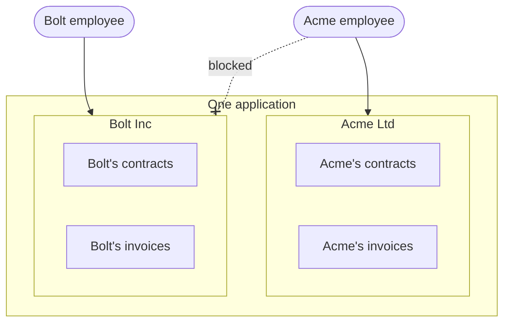
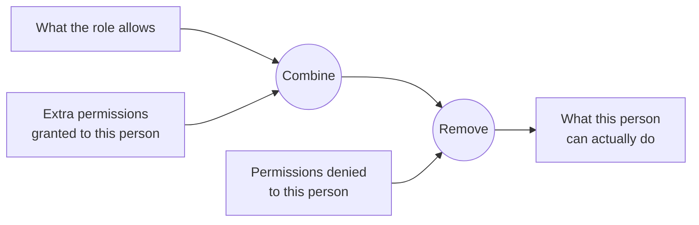
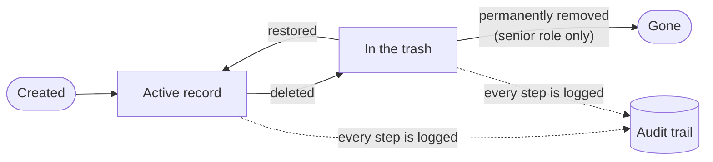

When a customer asks "is our data safe with you?", they are really asking three smaller questions. Can other companies see our data? Can the wrong person inside our company see or change it? And if something goes wrong, can you tell us what happened? Rhino 4 answers each one with a built-in feature.

<!-- truncate -->

## Question 1: can other companies see our data?

Most business software serves many customer companies from one system. The industry name for this is *multi-tenancy*, and each customer company is a *tenant*. A useful picture is an apartment building: one building, many apartments, and a key that opens only your own door.

The risk is obvious. If the walls between apartments are built by hand, one door at a time, sooner or later one is left unlocked.

In Rhino, a developer marks a type of record as belonging to an organization, and from then on every read and every write of that record is confined to the organization of the person asking. It is not a check that each screen has to remember. It applies to lists, searches, totals and exports alike. If someone tries to reach another organization's address, they are told that nothing exists there.

There is one deliberate exception. Your own support or operations team sometimes needs to work across all customers. Rhino lets you set up a separate back-office area for that, with its own sign-in and its own permissions, so the exception is a decision you made and not a hole someone found.

## Question 2: can the wrong person inside our company see it?

Inside one company, people have different jobs. Rhino handles this at three levels of detail.

**What a role may do.** An owner can do everything. An admin can manage day-to-day records. A viewer can only look. Permissions are set per role, per type of record and per action, so "admins may edit contracts but not permanently delete them" is one line of configuration.

**Exceptions for one person.** Real organizations have exceptions: the viewer who also needs to approve expenses, the admin who must not touch payroll. Rhino lets you grant or deny individual permissions to one person on top of their role. When a grant and a denial conflict, the denial wins. That is the safe default.

**Which fields a role may see.** Often the question is not "can they see the contract?" but "can they see the contract's value?". Rhino can hide individual fields per role. A hidden field is hidden completely: it does not appear on screen, and it also cannot be used to search, filter or sort. Without that last part, a curious user could sort a list by a hidden salary column and read the order.

The same applies to writing. Each role has a list of fields it may fill in or change, and an attempt to change anything else is refused.

## Question 3: if something goes wrong, can you tell us what happened?

Two features cover this.

**The audit trail** records every creation, change, deletion and restoration: what the values were before and after, who did it, and when. When a customer calls to ask why an order's status changed on Tuesday, the answer is a lookup, not an investigation.

**The trash** means that deleting a record does not destroy it. It moves to a trash, from which it can be restored. Emptying the trash for good is a separate action with its own permission, which you can reserve for the most senior role.

## Why "built in" matters

Any of these features can be built by hand, and many teams do build them. The difference is in how they fail.

Hand-built security fails at the edges: the new screen added in a hurry, the export nobody reviewed, the report written by a contractor. Rhino applies the rules at the level of the data, below the screens, so a new screen inherits them without anyone remembering to add them.

It also makes the rules easy to audit. They live in one known place for each type of record, written as short statements about roles and fields. A security reviewer, a new hire or a customer's due-diligence team can read them directly.

## A short checklist for your next vendor call

When a customer's security questionnaire arrives, a Rhino-based product can answer these plainly:

- Is each customer's data isolated from every other customer's? **Yes, automatically.**
- Are permissions role-based, with per-user exceptions? **Yes.**
- Can sensitive fields be restricted by role? **Yes, for reading and for writing.**
- Is there a change history? **Yes, with before and after values.**
- Can deleted data be recovered? **Yes, until it is permanently removed by an authorized person.**

## Where to go next

- [Rhino 4 in plain English](/blog/rhino-4-in-plain-english) explains the rest of what the library does.
- For developers: the [Laravel](/laravel/policies), [Rails](/rails/policies) and [NestJS](/nestjs/policies) policy guides show how these rules are written.
