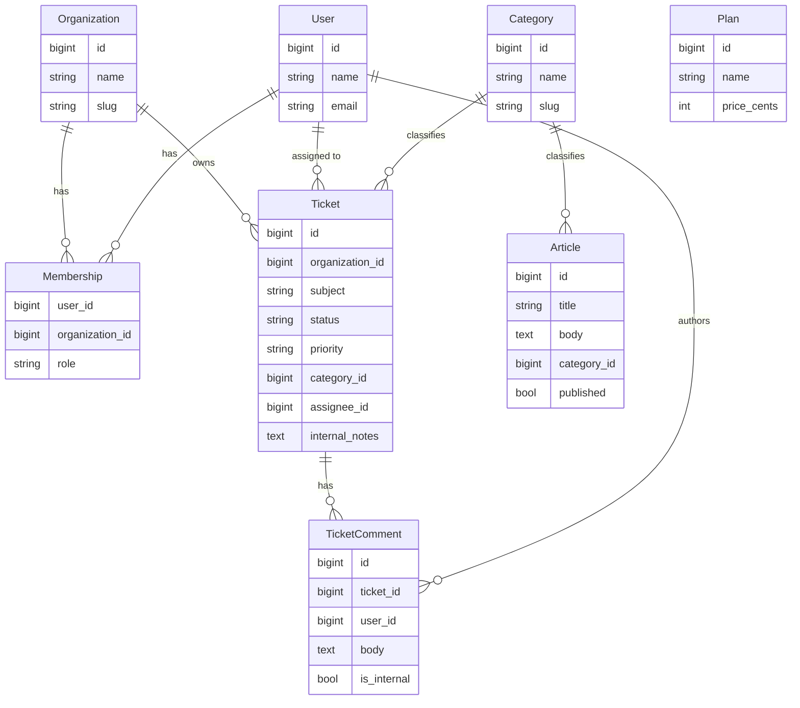

# Best Practices

Rhino **derives your entire REST API from your model definitions and config** — it is not a framework you hand-wire controllers into. Once a model is registered, Rhino generates `index`, `show`, `store`, `update`, `destroy`, `trashed`, `restore`, and `force-delete` endpoints, wires up filtering, sorting, search, sparse fieldsets, includes, and pagination from your `$allowed*` whitelists, enforces multi-tenant scoping and policies on every request, and hides columns per-role — all from what you *declared*. See the [Request Lifecycle](../request-lifecycle) for the full pipeline.

That inverts what "best practice" means here. You are almost never writing request-handling code. You are **declaring intent** — which fields are filterable, which roles may write which columns, how a model finds its organization, which route group exposes it — and trusting Rhino to enforce it uniformly. A bug in a hand-written controller leaks one endpoint; a wrong `$allowedFilters` or a missing `BelongsToOrganization` leaks *every* endpoint for that model at once. The leverage — and the risk — lives in the declarations.

The guiding principles, in order of how often they'll save you:

- **Declare, don't hand-code.** Reach for a controller only when no model property or policy method can express the behavior. If you *are* writing one, route it through Rhino so scoping and policies still apply.
- **Whitelist explicitly.** Every query surface (`$allowedFilters`, `$allowedSorts`, `$allowedIncludes`, `$allowedFields`, `$allowedSearch`, `$allowedScopes`) is opt-in. Add a field only when a client needs it; an over-broad whitelist is an information-disclosure bug.
- **Fail closed on tenancy and authorization.** Isolation and permission checks must deny by default. A model with no policy, or a nested model with no path to its organization, is a hole — not a convenience.
- **Keep custom code scoped through Rhino.** Custom controllers, dashboards, and bulk actions must build their queries through Rhino's scoped resolver so tenant isolation and policies are never bypassed.
- **Regenerate, don't hand-edit.** Models, migrations, factories, policies, and client types come from the generator and blueprint. Edit the source of truth (the model, the blueprint), then regenerate — don't patch the output.

Every page in this manual is a deep dive on one of these principles, applied end-to-end in a single example app.

## How to read this manual

This manual is **opinionated and paired**. Nearly every recommendation is shown as a **Bad/Good pair** — the wrong way immediately followed by the right way — so you can pattern-match against code you already have. The convention is a leading comment naming the reason:

```php title="the Bad/Good convention"
// ❌ Bad — allowing a client to filter on a field that leaks other tenants' rows
public static $allowedFilters = ['organization_id'];

// ✅ Good — organization scoping is automatic; never let clients pick the org
public static $allowedFilters = ['status', 'priority', 'category_id'];
```

:::tip Read the pairs, not just the "Good"
The ❌ block is usually a real mistake that *looks* reasonable and passes tests. The comment after `//` is the load-bearing part — it names the exact failure mode. Skim the Bad blocks first if you're auditing an existing app.
:::

Every page builds on **one example app**, described below. Model names, columns, roles, and route groups are identical across the whole manual, so a `Ticket` on the Authorization page is the same `Ticket` you configured on the Models page.

## The example app — Helpdesk

**Helpdesk** is a support-ticket SaaS with a shared knowledge base. It is deliberately **hybrid**: part of it is the vendor's own global catalog (single-tenant), and part of it is per-customer data isolated by organization (multitenant). This one app exercises every Rhino feature — two isolation mechanisms, a global model, three roles, attribute-level permissions, named and default scopes, a custom scoped controller, nested writes, soft deletes, and an audit trail.

### Data structure

| Model | Table | Route group | Tenancy | Key columns |
|---|---|---|---|---|
| `Organization` | `organizations` | tenant | *is* the tenant | `id`, `name`, `slug` |
| `User` | `users` | both | — | `id`, `name`, `email` |
| `Membership` | `memberships` | tenant | pivot | `user_id`, `organization_id`, `role` |
| `Category` | `categories` | app | **global** (no org) | `id`, `name`, `slug` |
| `Plan` | `plans` | app | **global** | `id`, `name`, `price_cents` |
| `Article` | `articles` | app | **global** | `id`, `title`, `body`, `category_id`, `published` |
| `Ticket` | `tickets` | tenant | **org column** (`organization_id`) | `id`, `organization_id`, `subject`, `status`, `priority`, `category_id`, `assignee_id`, `internal_notes` |
| `TicketComment` | `ticket_comments` | tenant | **relationship chain** (`ticket → organization`) | `id`, `ticket_id`, `user_id`, `body`, `is_internal` |



### Why it's hybrid

The app splits along the **catalog vs. tenant data** line, and that split maps directly onto the two route groups:

- **The `app` group is single-tenant** (the vendor's own staff area). It serves the **global catalog** — `Category`, `Plan`, `Article` — which every customer shares and no organization owns. These models have **no `organization_id`** and are scoped by user ownership, not by org. Routes carry no org segment (`GET /api/articles`).
- **The `tenant` group is multitenant** (customer organizations). It serves `Ticket` and `TicketComment`, each customer org's data isolated from every other's. Routes are prefixed with the org (`GET /api/{organization}/tickets`).

Crucially, the two tenant models isolate by **different mechanisms** — and both are Rhino built-ins:

- **`Ticket` isolates by column.** It has an `organization_id` and uses `BelongsToOrganization`; Rhino auto-filters `WHERE organization_id = ?` and auto-fills the column on create.
- **`TicketComment` isolates by relationship chain.** It has **no** `organization_id`. Rhino introspects its `BelongsTo` chain — `TicketComment → ticket → organization` — and derives the scope automatically. Get the relationship right and isolation follows; you never write the join.

Both mechanisms are covered in depth in [Tenant Safety](./tenant-safety).

### The three roles

Membership in a tenant org carries exactly one role, and it drives both row-level and attribute-level access:

- **`admin`** — full CRUD on the org's tickets and members; sees `internal_notes`.
- **`agent`** — CRUD on tickets, may add comments; sees `internal_notes`; cannot manage members.
- **`viewer`** — read-only tickets; does **not** see `internal_notes` or internal (`is_internal`) comments.

The `internal_notes` column and `is_internal` comments demonstrate **attribute-level permissions** — the same response returns different fields depending on the caller's role, enforced by the policy in [Authorization](./authorization).

## The hybrid route groups

**Route groups let one set of models answer to two different URL/middleware contexts.** Helpdesk registers two: `app` (single-tenant, no org segment) and `tenant` (multitenant, org-prefixed with membership enforcement). Grounded in the real [Route Groups](../route-groups) docs, the config is:

```php title="config/rhino.php"
'models' => [
    // Global catalog — served by the 'app' group
    'categories' => \App\Models\Category::class,
    'plans'      => \App\Models\Plan::class,
    'articles'   => \App\Models\Article::class,
    // Tenant data — served by the 'tenant' group
    'tickets'         => \App\Models\Ticket::class,
    'ticket-comments' => \App\Models\TicketComment::class,
],

'route_groups' => [
    // Single-tenant vendor staff area — global catalog, no org segment.
    'app' => [
        'prefix'     => '',            // GET /api/articles
        'middleware' => [],            // auth:sanctum only
        'models'     => ['categories', 'plans', 'articles'],
    ],

    // Multitenant customer area — org-prefixed, membership-enforced.
    'tenant' => [
        'prefix'     => '{organization}',  // GET /api/{organization}/tickets
        'middleware' => [\App\Http\Middleware\ResolveOrganizationFromRoute::class],
        'models'     => ['tickets', 'ticket-comments'],
    ],
],

'multi_tenant' => [
    'organization_identifier_column' => 'slug',  // /api/acme-corp/tickets
],
```

:::note The `tenant` name is reserved
Rhino registers the invitation and nested (`/nested`) routes under the group literally named `'tenant'`, and its middleware sets the organization on the request so scoping engages. Keep the multitenant group named `tenant`.
:::

Splitting the app into two groups is a design decision, not an accident. The Bad/Good version:

```php title="config/rhino.php"
// ❌ Bad — one flat group over every model. Global catalog now lives behind an
//          {organization} prefix, and tickets sit next to Article with no org
//          isolation contract — you're one missing scope away from a cross-tenant leak.
'route_groups' => [
    'default' => [
        'prefix'     => '{organization}',
        'middleware' => [\App\Http\Middleware\ResolveOrganizationFromRoute::class],
        'models'     => '*',   // Category, Plan, Article, Ticket, TicketComment — all mixed
    ],
],
```

```php title="config/rhino.php"
// ✅ Good — split by isolation model. Global catalog in a single-tenant group with
//          no org segment; tenant data in the org-prefixed group. Each group states
//          exactly which models it exposes and under which contract.
'route_groups' => [
    'app'    => ['prefix' => '',              'middleware' => [],                   'models' => ['categories', 'plans', 'articles']],
    'tenant' => ['prefix' => '{organization}', 'middleware' => [ResolveOrganizationFromRoute::class], 'models' => ['tickets', 'ticket-comments']],
],
```

**When to go hybrid vs. a single group:** use a single group when *all* your data shares one isolation rule (everything org-scoped, or nothing is). Reach for hybrid — like Helpdesk — the moment you have both a shared global surface and per-tenant data, or two audiences that reach the same models through different contexts. See [Route Groups](../route-groups) for domain constraints, group membership enforcement, and group-aware auth.

## Table of contents

- **[Models & Queries](./models-and-queries)** — model configuration and every query feature: filters, sorts, search, sparse fieldsets, includes, pagination, and named + default scopes.
- **[Authorization](./authorization)** — policies, per-org RBAC, attribute-level permissions, and how permission sources differ across the hybrid route groups.
- **[Tenant Safety](./tenant-safety)** — multi-tenancy, the two isolation mechanisms, always-on auto-scopes, and safe custom controllers via the resource-scope resolver.
- **[Data Lifecycle](./data-lifecycle)** — validation (including cross-tenant foreign keys), soft deletes, audit trail, hidden columns, and atomic nested operations.
- **[Codegen](./codegen)** — the blueprint YAML for the ticket tables, the generator workflow, and the exported client types.
