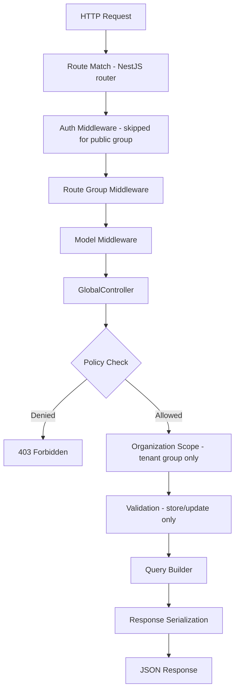

# Request Lifecycle

Every Rhino API request follows a predictable pipeline from route matching to JSON response. Understanding this flow helps you debug issues and know where to hook in custom behavior.

## Request Flow Overview



## Step-by-Step Breakdown

### 1. Route Matching

When you register a model in `src/rhino.config.ts`, Rhino generates a set of routes automatically. Each route is bound to a specific action on the `GlobalController`:

| Action | Route | Controller Method |
|--------|-------|-------------------|
| Index | `GET /api/:model` | `index()` |
| Store | `POST /api/:model` | `store()` |
| Show | `GET /api/:model/:id` | `show()` |
| Update | `PUT /api/:model/:id` | `update()` |
| Destroy | `DELETE /api/:model/:id` | `destroy()` |
| Trashed | `GET /api/:model/trashed` | `trashed()` |
| Restore | `POST /api/:model/:id/restore` | `restore()` |
| Force Delete | `DELETE /api/:model/:id/force-delete` | `forceDelete()` |

The model slug and route group key are stored in the route metadata, so the controller knows which model registration to resolve. Routes are named `rhino.{group}.{slug}.{action}` (e.g., `rhino.tenant.posts.index`). See [Route Groups](./route-groups) for details.

### 2. Auth Guard

For route groups other than `public`, the `JwtAuthGuard` runs first. It verifies the JWT from the `Authorization: Bearer <token>` header and attaches the authenticated user to `req.user`.

Routes in groups with `skipAuth: true` (such as the reserved `public` group) skip this step.

### 3. Route Group Middleware & Organization Resolution

Middleware classes defined on the route group run next. For the `tenant` route group, this is typically `ResolveOrganizationMiddleware`, which:

- Extracts the `:organization` route parameter (or resolves it from the host for subdomain mode) and looks up the Organization model by the configured identifier column (`id`, `slug`, or `uuid`).
- Verifies the authenticated user belongs to the organization.
- Sets `req.organization` for downstream consumers.

### 4. Model Middleware

If the registration defines `middleware` or `actionMiddleware`, those NestJS middleware classes are applied to the appropriate routes during registration:

```ts title="src/rhino.config.ts"
posts: {
  model: 'post',
  // Applied to all routes for this model
  middleware: [ThrottleMiddleware],
  // Applied only to specific actions
  actionMiddleware: {
    store: [VerifiedMiddleware],
    destroy: [AdminMiddleware],
  },
},
```

### 5. Model Resolution

The `GlobalController` extracts the model slug from the route metadata, looks up the `ModelRegistration` in the `models` map, and accesses the corresponding Prisma delegate via `PrismaService.model(registration.model)`.

### 6. Authorization

The controller resolves the policy from the registration's `policy` field (if defined) and calls the appropriate policy method (each also receives the resolved organization for tenant routes):

| Action | Policy Method | Arguments |
|--------|--------------|-----------|
| Index | `viewAny(user, org?)` | — |
| Show | `view(user, record, org?)` | Loaded record |
| Store | `create(user, org?)` | — |
| Update | `update(user, record, org?)` | Loaded record |
| Destroy | `delete(user, record, org?)` | Loaded record |
| Trashed | `viewTrashed(user, org?)` | — |
| Restore | `restore(user, record, org?)` | Loaded record |
| Force Delete | `forceDelete(user, record, org?)` | Loaded record |

If no policy is defined, all actions are allowed.

For `?include=` parameters, the controller also checks `viewAny` permission on each related model's policy. A 403 is returned if the user lacks permission for any requested include.

### 7. Organization Scoping

When an organization is present in the request context (set by middleware in the `tenant` route group) and the registration has `belongsToOrganization: true`, the controller applies organization filtering to the query. Non-tenant route groups skip this step. The scoping strategy follows this order of precedence:

1. **Resource IS the Organization model** -- restrict to the current org's primary key
2. **Model has an `organizationId` column** -- simple `WHERE organizationId = ?`
3. **`owner` chain is configured / auto-detected** -- Rhino walks the foreign-key relation(s) named by `owner` to find a model with `organizationId` and filters via a nested relation condition
4. **No relationship found** -- model is global (no scope applied)

### 8. Validation

For `store` and `update` actions, the controller resolves permitted fields from the policy (`permittedAttributesForCreate` or `permittedAttributesForUpdate`), checks for forbidden fields (returns 403), then runs Zod validation against the registration's schema (`validation` / `validationStore` / `validationUpdate`). If validation fails, a 422 response is returned with the error details:

```json title="Response"
{
  "errors": {
    "title": ["The title field is required."],
    "content": ["The content field must be a string."]
  }
}
```

### 9. Query Execution

The `QueryBuilderService` translates URL query parameters into Prisma operations:

1. Filters -- `?filter[status]=published`
2. Sorts -- `?sort=-createdAt,title`
3. Search -- `?search=nestjs`
4. Includes -- `?include=author,comments`
5. Field selection -- `?fields[posts]=id,title`
6. Pagination -- `?page=1&per_page=20`

### 10. Response

The controller returns a JSON response. For paginated results, metadata is sent in response headers:

```
X-Current-Page: 1
X-Last-Page: 10
X-Per-Page: 20
X-Total: 195
```

The response body contains the data array (for index endpoints) or a single object (for show/store/update). Delete operations return a `204 No Content` response.

## Action Exclusion

Models can opt out of specific routes using `exceptActions`:

```ts title="src/rhino.config.ts"
settings: {
  model: 'setting',
  // Only allow index and show -- no create, update, or delete
  exceptActions: ['store', 'update', 'destroy', 'trashed', 'restore', 'forceDelete'],
},
```

Valid action names: `index`, `show`, `store`, `update`, `destroy`, `trashed`, `restore`, `forceDelete`.

## Error Responses

Rhino uses a consistent JSON error format across all actions:

| Status | Meaning | Example |
|--------|---------|---------|
| `403` | Authorization denied | `{ "message": "This action is unauthorized." }` |
| `404` | Resource not found | `{ "message": "Organization not found" }` |
| `422` | Validation failed | `{ "errors": { "title": ["..."] } }` |
| `204` | Success (no content) | Empty body (delete operations) |
